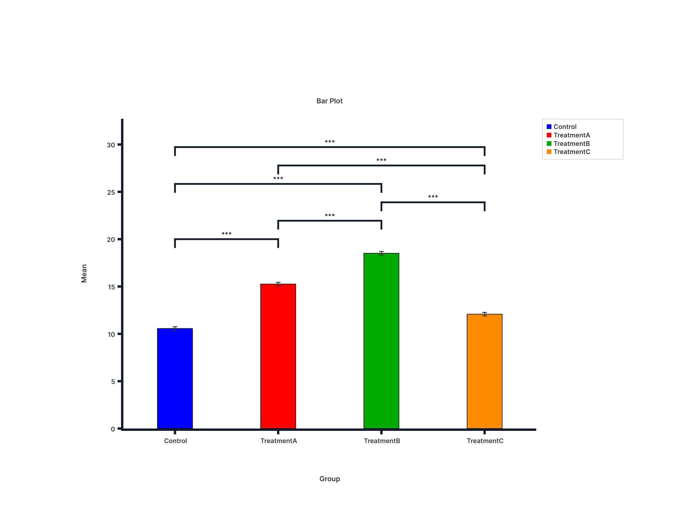
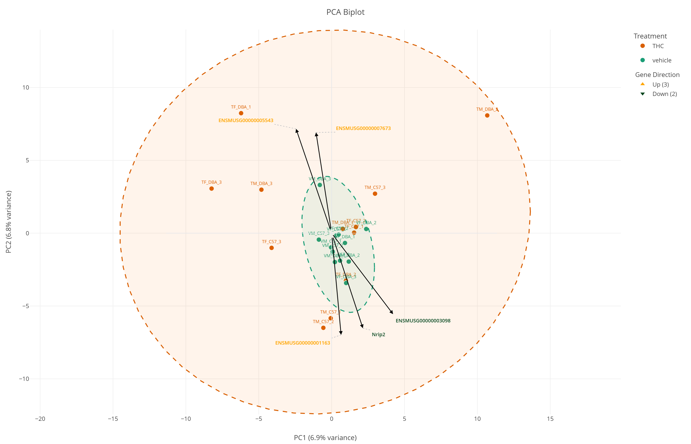
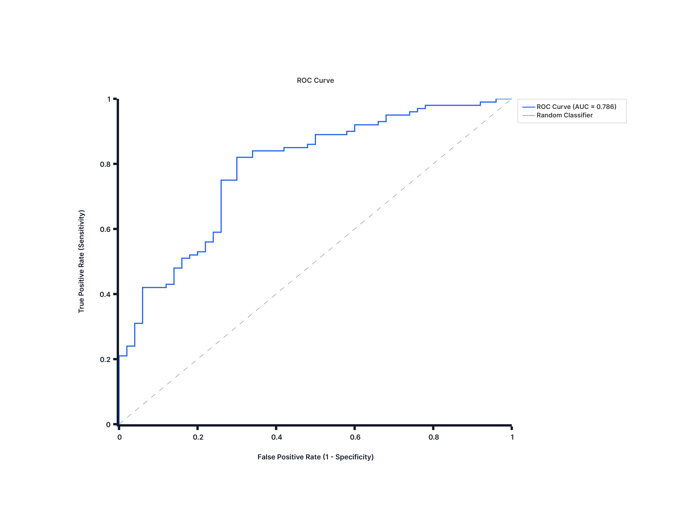
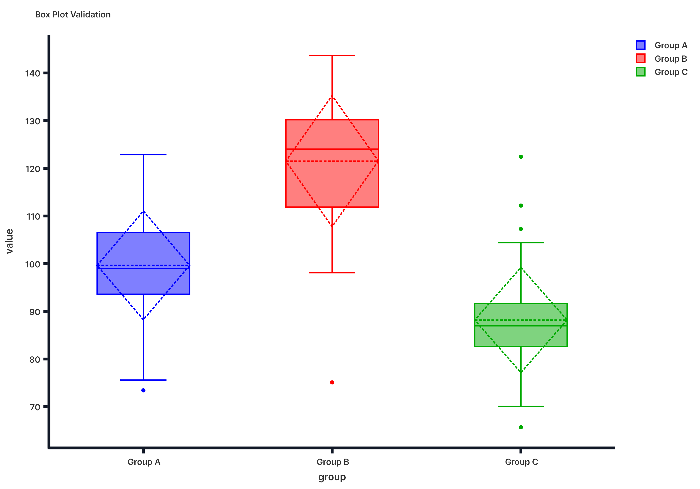
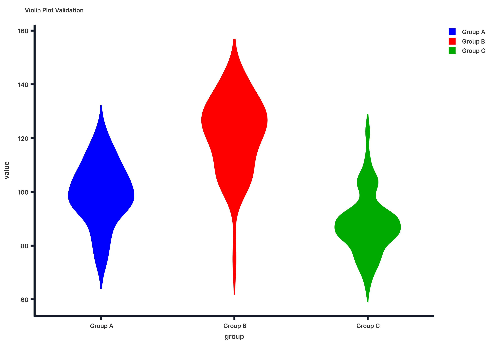
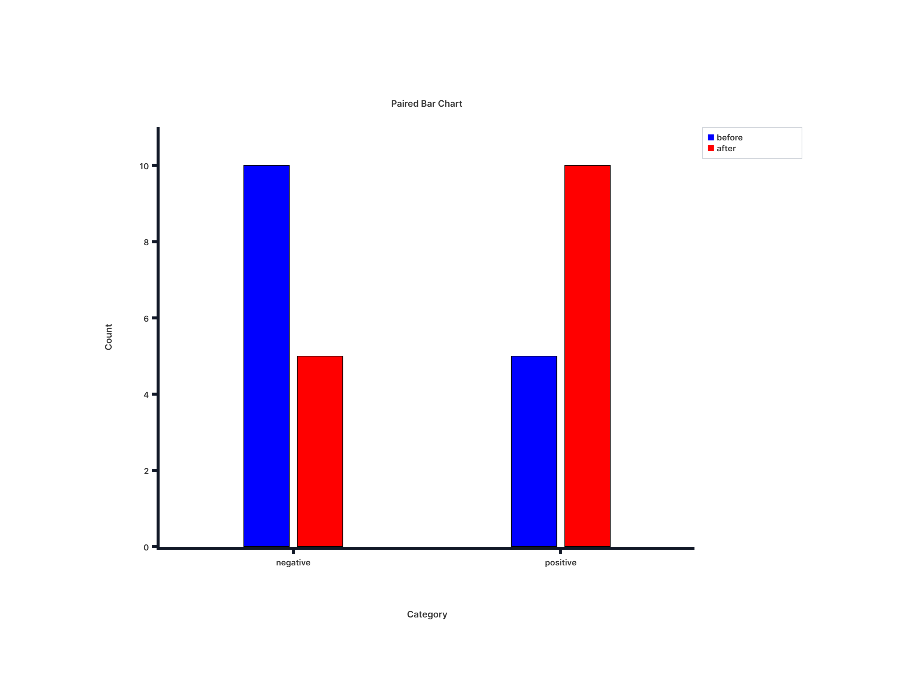
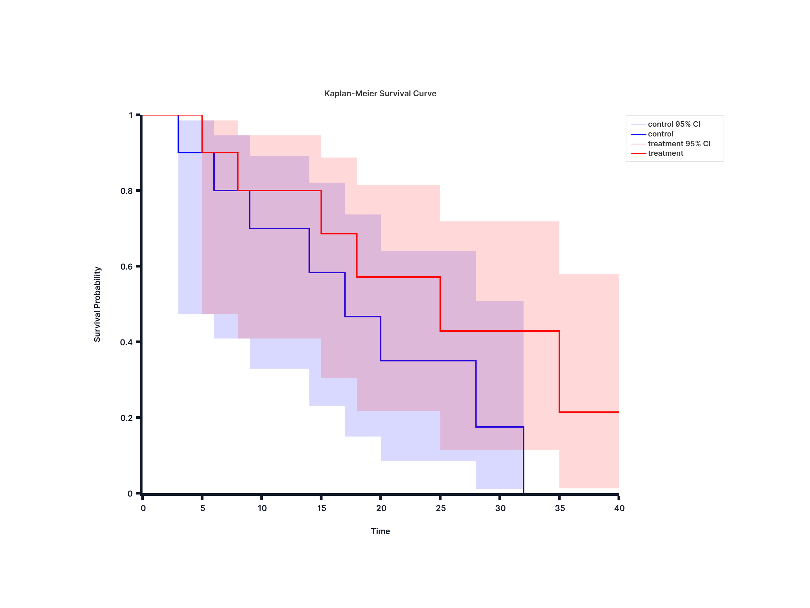
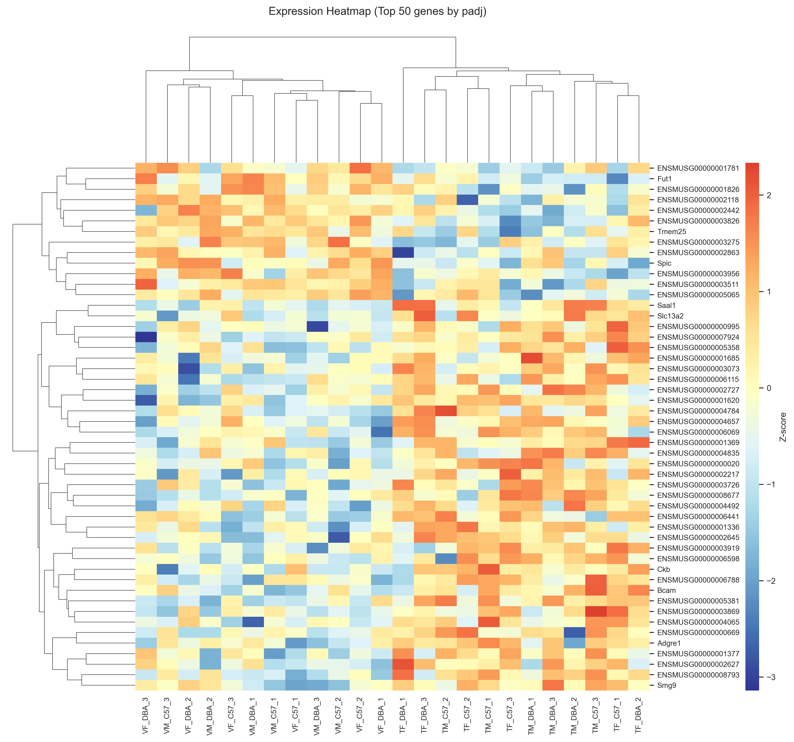
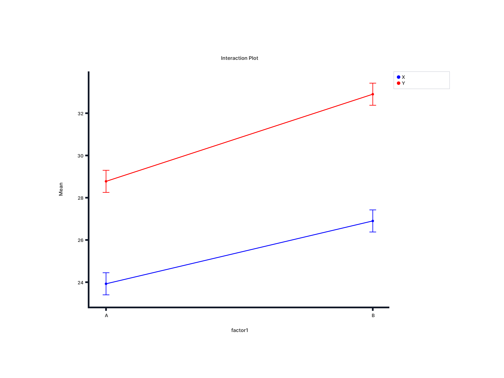

# easyCris

**Professional statistical analysis and RNA-seq for researchers — no coding required.**

> **Beta Release:** easyCris is actively improving and may still contain bugs or unfinished edge cases.

<table>
  <tr>
    <td></td>
    <td></td>
  </tr>
</table>

---

## 🔒 Privacy

easyCris runs entirely on your machine.
Your data, files, and results never leave your computer — nothing is uploaded or transmitted.
No account required.
The in-app updater checks release metadata and only downloads update files when you choose to install.
No usage data, analysis data, file contents, or personal information is sent.

---

## 🧪 What is easyCris?

easyCris is a desktop application for scientific data analysis — covering classical statistics, pharmacology, bulk RNA-seq differential expression, and data cleaning tools, all in one place. Core workflows are implemented with established statistical methods and manuscript references listed below, giving you publication-ready output without writing a single line of code. All computation runs locally using an embedded analysis engine; no external software installation is required.

---

## ⬇️ Download

**[→ Download Latest Beta Release](https://github.com/easyCris-software/easyCris/releases/latest)**

Windows x64 installer (`.exe`). Once installed, the app supports in-app updates through signed release packages.

---

## ✅ Statistical Methods

Core statistical workflows and the RNA-seq pipeline follow published methods listed in the Citations section.
References are provided to support manuscript-ready reporting.

---

## 📊 Statistical Analysis

easyCris covers 30+ statistical tests across seven analysis groups. Most tests produce a results table and auto-generated interactive plots.

### 🔬 Parametric Tests

| Test | Accepted Data Format |
|---|---|
| Independent Samples T-Test | Wide or Long |
| Paired Samples T-Test | Wide or Long *(wide preferred)* |
| One Sample T-Test | Wide (single column) |
| One-Way ANOVA | Wide or Long |
| Two-Way ANOVA | Long only |
| Multifactorial ANOVA (3-way) | Long only |

Post-hoc corrections available for ANOVA: Tukey, Bonferroni, Holm, Holm-Sidak, Sidak, Dunnett, FDR-BH.
Two-Way and Multifactorial ANOVA include interaction plots; simple effects analysis is available as an optional step.

### 📉 Nonparametric Tests

| Test | Accepted Data Format | Parametric equivalent |
|---|---|---|
| Mann-Whitney U Test | Wide or Long | Independent T-Test |
| Wilcoxon Signed-Rank Test | Wide or Long *(wide preferred)* | Paired T-Test |
| Kruskal-Wallis H Test | Wide or Long | One-Way ANOVA |
| Scheirer-Ray-Hare Test | Long only | Two-Way ANOVA |

### 📐 Regression & Correlation

Wide format — one column per variable, one row per observation.

| Test | Input |
|---|---|
| Simple Linear Regression | 1 outcome column + 1 predictor column |
| Multiple Linear Regression | 1 outcome column + 2 or more predictor columns |
| Binary Logistic Regression | 1 binary outcome column + 1 or more predictor columns |
| Multinomial Logistic Regression | 1 multi-class outcome column + 1 or more predictor columns |
| Pearson / Spearman / Kendall Tau Correlation | 2 or more numeric columns |

<table>
  <tr>
    <td></td>
    <td></td>
    <td></td>
  </tr>
  <tr>
    <td align="center"><em>ROC Curve</em></td>
    <td align="center"><em>Box Plot</em></td>
    <td align="center"><em>Violin Plot</em></td>
  </tr>
</table>

### 🗂️ Categorical Analysis

Wide format — one column per variable, one row per observation.

| Test | Input |
|---|---|
| Chi-Square Independence Test | 2 categorical columns |
| Chi-Square Goodness of Fit | 1 categorical column |
| Fisher's Exact Test | 2 categorical columns (2 categories each) |
| McNemar's Test | Before column + After column (paired) |

### 📏 Distribution & Descriptive

Wide format — select one or more numeric columns.

| Test | Description |
|---|---|
| Shapiro-Wilk | Normality test (small to medium samples) |
| Kolmogorov-Smirnov | Normality test against a specified distribution |
| Anderson-Darling | Normality test with emphasis on distribution tails |
| Cramer-von Mises | Goodness-of-fit normality test |
| Jarque-Bera | Normality test based on skewness and kurtosis |
| Normality (All Tests) | Run all 5 normality tests simultaneously on a selected column |
| Descriptive Statistics | Mean, median, SD, quartiles, and outliers for 1 or more columns |
| Outlier Detection | Identify outliers across 1 or more numeric columns |

### 💊 Pharmacology & Dose-Response

Wide format — separate columns for dose and response values.

| Model | Description |
|---|---|
| 3-Parameter Logistic (3PL) | Fits IC50 / EC50 with fixed bottom (0) |
| 4-Parameter Logistic (4PL) | Fits IC50 / EC50 with variable Hill slope |

### ⏱️ Survival Analysis

Wide format — separate columns for time-to-event, event status, and grouping or predictor variables.

| Test | Input |
|---|---|
| Kaplan-Meier Analysis | Time column + event column + group column |
| Cox Proportional Hazards | Time column + event column + 1 or more predictor columns |
| Nelson-Aalen Estimator | Time column + event column + group column |

### 🔗 Mediation & Moderation

Wide format — one column per variable, one row per observation.

| Analysis | Variables |
|---|---|
| Mediation Analysis (Baron & Kenny Model 4) | Exposure (X), Mediator (M), Outcome (Y) |
| Simple Moderation (Model 1) | Predictor (X), Moderator (W), Outcome (Y) |
| Moderated Mediation (Model 7) | Predictor (X), Mediator (M), Moderator (W), Outcome (Y) |

---

> 💡 **Data format tip:** easyCris accepts both wide and long formats where noted above.
> Use the built-in **Pivot Wider** and **Pivot Longer** tools in Data Cleaning to convert between formats before running your analysis.

---

## 🧬 RNA-seq Analysis

easyCris includes a complete bulk RNA-seq differential expression workflow, from raw count matrix to annotated results and QC plots.

### Data Preparation

| Step | Details |
|---|---|
| Count matrix | Raw integer counts (CSV) from featureCounts, HTSeq, STAR, GEO, or recount3 |
| Sample metadata | CSV with experimental factors — Treatment, Batch, Cell Line, Time Point, and more |
| Gene ID lookup | Ensembl, Entrez, UniProt, UniProt Swiss-Prot IDs → gene symbols |
| Duplicate genes | Sum duplicates or keep first occurrence |

### Model Configuration

| Model | Use case |
|---|---|
| Simple `~condition` | Compare two groups (e.g., Treated vs Control) |
| Multi-factor `~condition + batch` | Adjust for batch effects or continuous covariates |
| Interaction `~genotype * treatment` | Test whether treatment effect varies by genotype or cell line |
| Multi-run comparator | Run multiple contrasts in the same project and review results side by side |

### Results & Visualizations

| Output | Description |
|---|---|
| Results table | gene, baseMean, log2FoldChange, lfcSE, pvalue, padj (Benjamini-Hochberg) |
| PCA biplot | Samples colored by experimental factor — identify batch effects and outliers |
| Volcano plot | log2 fold change vs adjusted p-value — quick overview of the DE landscape |
| Heatmap | Significant genes filtered by adjusted p-value |

<table>
  <tr>
    <td></td>
    <td></td>
  </tr>
  <tr>
    <td align="center"><em>PCA Biplot</em></td>
    <td align="center"><em>Significant Gene Heatmap</em></td>
  </tr>
</table>

---

## 🧹 Data Cleaning

easyCris includes a set of data preparation tools to reshape, filter, and summarise your data before analysis. Each tool has a built-in reference guide with before-and-after examples accessible from the Help menu.

### Reshape

| Tool | When to use | What changes |
|---|---|---|
| **Pivot Wider** | Repeated measures are stacked in rows and you need them as separate columns — e.g., Pre/Post in one column → two separate columns | Row count decreases; column count increases |
| **Pivot Longer** | Each measurement is a separate column and you need them stacked for analysis — e.g., preparing data for repeated-measures tests that expect long format | Row count increases; column count decreases |

### Filter & Sort

| Tool | When to use | What changes |
|---|---|---|
| **Advanced Filter** | Keep only rows matching specific criteria — supports multiple conditions with AND / OR logic and parenthesized grouping | Non-matching rows removed; column structure preserved |
| **Sort** | Reorder rows by a specific variable — ascending or descending | Row order changes; no rows or columns added or removed |

### Summarise

| Tool | When to use | What changes |
|---|---|---|
| **Group & Aggregate** | Compute group means, sums, counts, or other statistics from raw data — e.g., mean score per treatment group | One row per unique group combination; values replaced by computed aggregate |
| **Outline** | Scan data by category without permanently reshaping — expand or collapse row groups to focus on one subset at a time | Data values unchanged; display only |

---

## 🧮 Formula Engine

The easyCris grid formula engine supports spreadsheet-style formulas with dependency tracking, autocomplete, and backend-assisted evaluation for large ranges.

Autocomplete is intentionally limited to these categories (from the current allowed formula set):

| Category | Count | Examples |
|---|---:|---|
| **Math & Trigonometry** | 61 | SUM, ABS, ROUND, SQRT, MOD, LOG, SIN, COS, POWER |
| **Statistical** | 99 | AVERAGE, STDEV.S, COUNT, CORREL, PERCENTILE, NORM.DIST, T.DIST |
| **Date & Time** | 25 | TODAY, NOW, DATE, DATEDIF, NETWORKDAYS, YEAR, MONTH, DAY |
| **Financial** | 55 | NPV, IRR, PMT, FV, RATE |
| **Engineering** | 54 | BIN2DEC, HEX2DEC, CONVERT, COMPLEX, ERF, DELTA, GESTEP |

> Formulas use familiar spreadsheet syntax and run directly in the grid (no scripting required).

---

## 📈 Interactive Plots

All plots are interactive — hover for values, zoom, pan, and export as PNG.

Plots are auto-generated based on the test you run:

| Category | Plot types |
|---|---|
| Hypothesis testing | Bar, box, violin with significance brackets |
| ANOVA | Interaction plots, faceted grouped bar |
| Regression | Scatter, residual, forest, ROC |
| Categorical | Grouped bar, mosaic, heatmap |
| Distribution | Histogram, Q-Q plots, column scatter |
| Survival | Kaplan-Meier curves, cumulative hazard, forest |
| RNA-seq | PCA biplot, volcano, heatmap |
| Pharmacology | Dose-response curves |

<table>
  <tr>
    <td></td>
    <td></td>
    <td></td>
  </tr>
  <tr>
    <td align="center"><em>ANOVA + Tukey</em></td>
    <td align="center"><em>Interaction Plot</em></td>
    <td align="center"><em>Kaplan-Meier</em></td>
  </tr>
</table>

---

## 📖 In-App Help

easyCris ships with three built-in reference guides accessible from the Help menu:

| Guide | Contents |
|---|---|
| 📊 **Statistical Tests Guide** | Quick reference for every test — required inputs, parameters, and the plots that will be generated |
| 🧬 **RNA-seq Guide** | Step-by-step walkthrough from count matrix import to differential expression results |
| 🧹 **Data Cleaning Guide** | Reference for every reshape, filter, and aggregate tool with before-and-after examples |

---

## 💻 System Requirements

| | |
|---|---|
| OS | Windows 10 / 11 (x64) |
| RAM | 4 GB minimum, 8 GB recommended |
| Disk | ~200 MB |
| Internet | Not required for analysis; required only for update checks and downloads |

> macOS and Linux builds are planned for a future release.

---

## 🚀 Getting Started

1. Download the installer from the [Releases page](https://github.com/easyCris-software/easyCris/releases/latest)
2. Run the `.exe` installer (admin rights may depend on your system policy)
3. Open easyCris and import your CSV data
4. Select a statistical test or analysis workflow
5. Review your results table and auto-generated plots

---

## 📚 Citations

If you use easyCris in published research, please cite the underlying methods:

| Module | Citation |
|---|---|
| t-Tests & ANOVA | Student (1908). The probable error of a mean. *Biometrika*, 6(1), 1-25. https://doi.org/10.1093/biomet/6.1.1; Fisher (1925). *Statistical Methods for Research Workers*. Oliver and Boyd. |
| Rank-Based Nonparametric Tests | Wilcoxon (1945). Individual comparisons by ranking methods. *Biometrics Bulletin*, 1(6), 80-83; Mann & Whitney (1947). On a test of whether one of two random variables is stochastically larger than the other. *Annals of Mathematical Statistics*, 18(1), 50-60. https://doi.org/10.1214/aoms/1177730491; Kruskal & Wallis (1952). Use of ranks in one-criterion variance analysis. *JASA*, 47(260), 583-621. https://doi.org/10.1080/01621459.1952.10483441; Dunn (1964). Multiple comparisons using rank sums. *Technometrics*, 6(3), 241-252. https://doi.org/10.1080/00401706.1964.10490181 |
| Regression & Correlation | Pearson (1895). Note on regression and inheritance in the case of two parents. *Proceedings of the Royal Society of London*, 58, 240-242. https://doi.org/10.1098/rspl.1895.0041; Spearman (1904). The proof and measurement of association between two things. *American Journal of Psychology*, 15(1), 72-101. https://doi.org/10.2307/1412159; Kendall (1938). A new measure of rank correlation. *Biometrika*, 30(1/2), 81-93. https://doi.org/10.1093/biomet/30.1-2.81; Cox (1958). The regression analysis of binary sequences. *JRSS Series B*, 20(2), 215-242. https://doi.org/10.1111/j.2517-6161.1958.tb00292.x |
| Survival Analysis | Kaplan & Meier (1958). Nonparametric estimation from incomplete observations. *JASA*, 53(282), 457-481. https://doi.org/10.1080/01621459.1958.10501452; Cox (1972). Regression models and life-tables. *JRSS Series B*, 34(2), 187-220. https://doi.org/10.1111/j.2517-6161.1972.tb00899.x; Nelson (1969). Hazard plotting for incomplete failure data. *Journal of Quality Technology*, 1(1), 27-52. https://doi.org/10.1080/00224065.1969.11980344 |
| Dose-Response (3PL / 4PL) | Hill (1910). The possible effects of the aggregation of the molecules of haemoglobin on its dissociation curves. *Journal of Physiology*, 40(Suppl), iv-vii. https://doi.org/10.1113/jphysiol.1910.sp001386; Sebaugh (2011). Guidelines for accurate EC50/IC50 estimation. *Pharmaceutical Statistics*, 10(2), 128-134. https://doi.org/10.1002/pst.426 |
| Mediation & Moderation | Baron & Kenny (1986). The moderator-mediator variable distinction in social psychological research. *Journal of Personality and Social Psychology*, 51(6), 1173-1182. https://doi.org/10.1037/0022-3514.51.6.1173; Sobel (1982). Asymptotic confidence intervals for indirect effects in structural equation models. *Sociological Methodology*, 13, 290-312. https://doi.org/10.2307/270723; Hayes (2022). *Introduction to Mediation, Moderation, and Conditional Process Analysis: A Regression-Based Approach* (3rd ed.). Guilford Press (PROCESS framework); Preacher, Rucker, & Hayes (2007). Addressing moderated mediation hypotheses. *Multivariate Behavioral Research*, 42(1), 185-227. https://doi.org/10.1080/00273170701341316 |
| RNA-seq Differential Expression | Love, Huber, & Anders (2014). Moderated estimation of fold change and dispersion for RNA-seq data with DESeq2. *Genome Biology*, 15, 550. https://doi.org/10.1186/s13059-014-0550-8; Zhu, Ibrahim, & Love (2019). Heavy-tailed prior distributions for sequence count data. *Bioinformatics*, 35(12), 2084-2092. https://doi.org/10.1093/bioinformatics/bty895 |

---

## ⚖️ License

Copyright © easyCris Software. All rights reserved.
Unauthorized copying, distribution, or modification is prohibited.
By downloading and using easyCris you agree to the Terms of Use included with the installer.

## ⚠️ Disclaimer

easyCris is intended for research purposes only.
It is not a medical device and should not be used for clinical diagnosis or treatment decisions.
